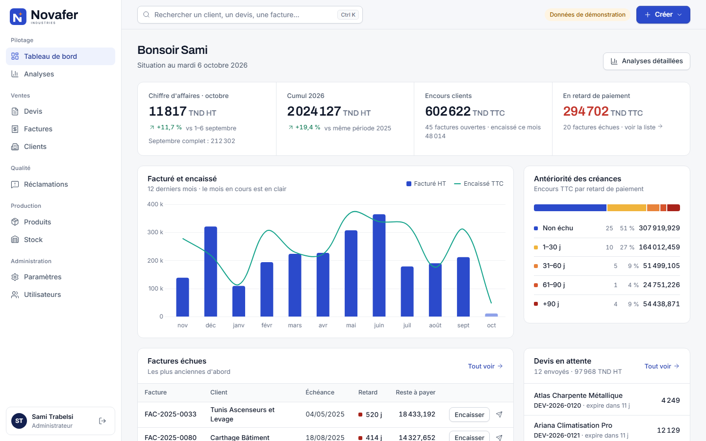
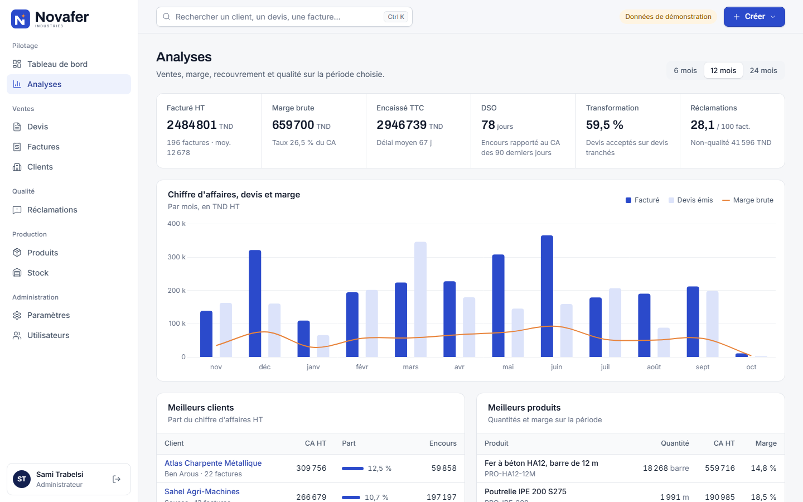
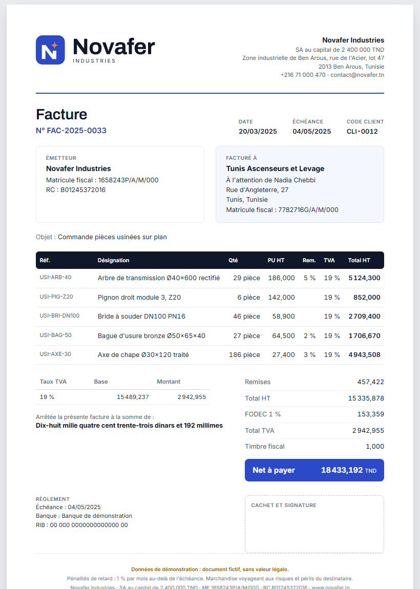
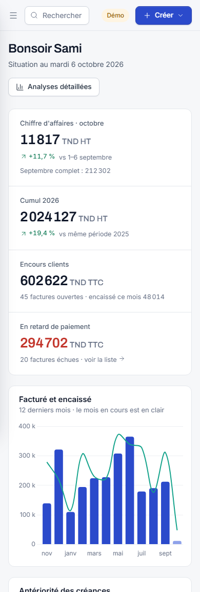
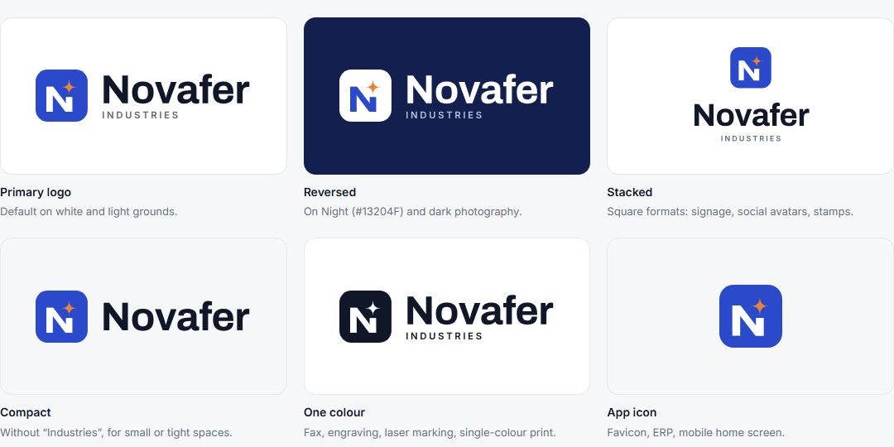

# Novafer ERP

ERP for **Novafer Industries**, a (fictional) Tunisian manufacturer of metal and industrial parts. It covers the catalogue, clients, stock, the devis → facture → règlement chain, réclamations (client complaints) and an analytics dashboard. The interface is in French and follows Tunisian invoicing rules.

> **Portfolio project, all rights reserved.** You're welcome to read the code and run it locally to evaluate my work. Using, copying, modifying or redistributing it, or the Novafer brand, requires my written permission. See [LICENSE](LICENSE).



| Analytics | Printed invoice (A4) |
|---|---|
|  |  |

| Phone layout | Brand identity |
|---|---|
|  |  |

*All companies, people and figures in the screenshots are demo data.*

| Layer | Technology |
|---|---|
| Frontend | Angular 21 (standalone components, signals, zoneless), Chart.js, Lucide icons, Inter + Archivo |
| Backend | Spring Boot 4.1 (Java 21), Spring Security with JWT, Spring Data JPA, Flyway |
| Database | PostgreSQL 18 |

## Run it locally

You need Docker, Java 21+, Maven and Node 20.19+ / 22.12+ / 24+.

1. Start PostgreSQL on port **5434**, so it doesn't clash with a local PostgreSQL (change `POSTGRES_PORT` in `.env` if needed):

   ```bash
   docker compose up -d postgres
   ```

2. Start the API on http://localhost:8085. On first start it creates the schema and the demo data:

   ```bash
   cd backend
   mvn spring-boot:run
   ```

3. Start the frontend on http://localhost:4200. It proxies `/api` to the backend:

   ```bash
   cd frontend
   npm install
   npm start
   ```

Or run the whole stack in Docker on http://localhost:8086:

```bash
docker compose up -d --build
```

Copy `.env.example` to `.env` to change ports, secrets or the first administrator. API documentation is at http://localhost:8085/swagger-ui.html.

To start again from fresh demo data, delete the database volume and restart the API. This erases everything in the Novafer database:

```bash
docker compose down -v
```

## Demo accounts

The dev profile seeds a fictional company with 22 months of history: 24 clients, 37 products, about 280 devis, 350 factures with payments, and réclamations. Every company, person and figure in it is invented, and the app shows "Données de démonstration" while it is loaded. All demo accounts share the password set by `DEMO_PASSWORD` in `backend/src/main/resources/application-dev.yml`.

| E-mail | Role | Can modify |
|---|---|---|
| direction@novafer.tn | Administrateur | Everything, including users and settings |
| l.bensalem@novafer.tn | Direction | Everything except users and settings |
| k.jaziri@novafer.tn / y.hammami@novafer.tn | Commercial | Devis, clients, réclamations |
| n.gharbi@novafer.tn | Comptabilité | Factures, règlements, clients, réclamations |
| h.mansour@novafer.tn | Qualité | Réclamations |
| r.bouaziz@novafer.tn | Magasin | Produits, stock, réclamations |

Every role can read every module. For a real deployment, set `SPRING_PROFILES_ACTIVE` to something other than `dev` (no demo data), set `JWT_SECRET`, and create the first administrator with `ADMIN_EMAIL` / `ADMIN_PASSWORD`.

## What it does

- **Tableau de bord**: month and year revenue with like-for-like deltas, receivables and overdue amounts, invoiced vs collected over 12 months, receivables aging (not due → 90+ days), overdue factures with *Encaisser* / *Relancer*, pending devis, urgent réclamations, low stock.
- **Analyses** (6 / 12 / 24 months): revenue, gross margin, collections, DSO, quote conversion, top clients and products, sales by family, quote funnel, payment methods, réclamations by type and resolution time.
- **Devis**: editor with catalogue lines, discounts and a live tax preview; draft → sent → accepted / refused / expired; duplicate; convert to a facture.
- **Factures**: drafts have no number. Issuing assigns the gap-free legal number (FAC-YYYY-NNNN), adds the timbre fiscal and takes the goods out of stock. Then partial or full payments; cancellation returns the goods to stock. Reminder letter (*lettre de relance*) for overdue factures.
- **Printing**: A4 devis, factures and reminder letters with both parties' identifiers, the VAT summary, the amount in words ("Mille cent soixante dinars et 228 millimes"), the RIB and a stamp box. Print or save as PDF from the browser.
- **Réclamations**: linked to the client, facture and product; type, priority, assignee, estimated cost of non-quality; open → in progress → resolved → closed, with a full history.
- **Clients, Produits, Stock**: client standing (revenue, balance, average payment delay); catalogue with margins and alert thresholds; stock ledger with entries, exits and inventory adjustments.
- **Paramètres and Utilisateurs**: company identity printed on documents, fiscal rules, users and roles.

### Tunisian rules built in

- Amounts in TND with three decimals (millimes), rounded half-up.
- TVA 19 %, 13 %, 7 % or 0 %; a summary per rate on every document.
- FODEC 1 % on industrial sales, included in the TVA base. It can be turned off in settings.
- Timbre fiscal (1,000 TND by default) on each facture.
- Clients in VAT suspension (totally exporting companies) are invoiced without TVA or FODEC, and the document says so.
- Separate yearly numbering for devis, factures and réclamations.

Check these rates and mentions with your accountant before using the system for real invoices.

## Project layout

```
backend/    Spring Boot API: domain, services, REST controllers, Flyway migrations, demo seeder
frontend/   Angular app: core (API, auth, formats), shared UI, one folder per feature
brand/      Logo files (SVG + PNG), brand guidelines page and its build script
```

## Brand

The name, logo and guidelines are in `brand/`. Open `brand/brand-guidelines.html` in a browser. To rebuild it after editing `brand/src/guidelines.template.html`, run this from the project root with two fresh screenshots (dashboard and printed facture):

```bash
node brand/src/build-guidelines.mjs <dashboard.png> <facture.png>
```

The name "Novafer" has not been checked for trademark availability.

## Licence

Copyright © 2026 Firas. All rights reserved. This is not open-source software: you may view the code and run it locally to evaluate it, and any other use needs written permission. Full terms in [LICENSE](LICENSE). Third-party libraries, fonts and icons keep their own licences.
